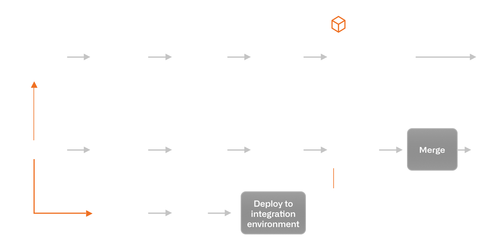

## Review
Spring
    - Dependency Injection
        - annotation
            - @Autowired
                - @Primary
                - @Qualifier
        - By Setters
        - By Constructor
        - By properties

Servlet
- life cycle (creation to desturction)
    - init()
    - service() (serve client's request)
    - destroy() (terminated)
    - garbage collected

Http Status Code
- 2xx success
- 3xx redirect
- 4xx client error
- 5xx server error
## New Things
project management
- Agile
    - sprint cycle
- Waterfall style

CI/CD
- continuous integration
    - every commit made in repo is triggering a build -> test -> merge
- continuous delivery
    - commit to application are automatically tested and uploaded -> then deploy to live production
- automation, deployment tools
    - Jenkins
        - workflow: new features on source -> pick up changed code & build -> run tests -> automatic notification
- how CI/CD interact with Github
    - example workflow

## Plans for tomorrow
- coding problems
- http request body, res body
- Basic of Tomcat
- 3-way handshake, 4-way handshake