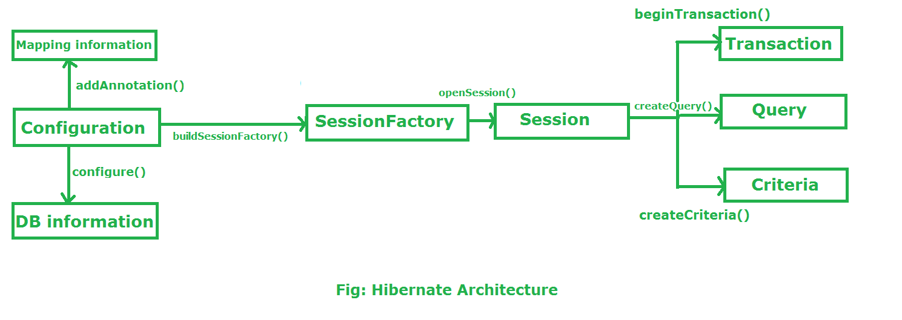

## Review
- Why do we use spring boot?
    - Spring Boot is a wrapper of Spring framework and comes with embedded tomcat server. We can create spring boot applications that run on their own.
- Hibernate Session Factory
    - Hibernate Architecture 
    - thread-safe
    - one SessionFactory per database in any application
    - buildSessionFactory() method gathers the meta-data which is in the cfg Object. 
From cfg object it takes the JDBC information and create a JDBC Connection.
SessionFactory factory=cfg.buildSessionFactory();

- Review URL design
    - use nouns to define the entity
    - keep verbs out of URLs
    - Document the APIs
- Spring Boot Configurations
    - class-level annotation
    - @Configuration classes declare beans via public @Bean annotated methods. Calls to @Bean methods on @Configuration classes can also be used to define inter-bean dependencies.
## New Things
day off today
## Plans For Tomorrow
- Coding Problems
- review Spring Boot Demo
- review company interviews