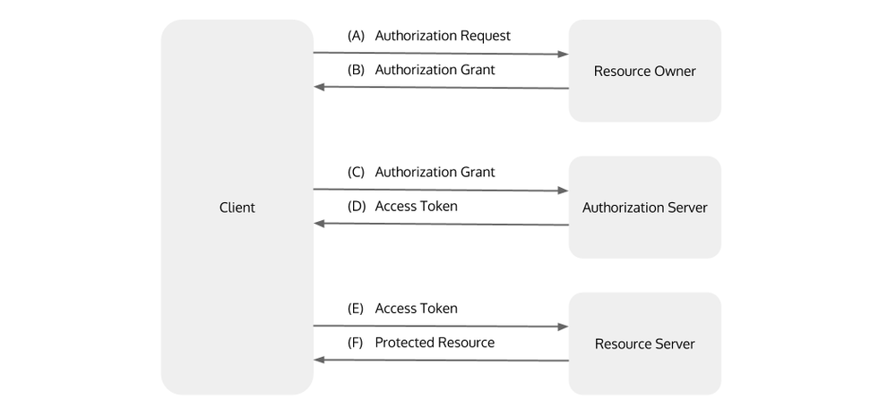

## Review
⦁ JAR v.s. WAR 

    - JAR contains librarires, resources and accessories files
    - WAR contains web application that can be deployed on servlet container, it contains jsp, html, javascript and other files for the application

⦁	What is MVC? 

    - it's a software design pattern consists of three parts: model, view, and controller.
        - model handles the data logic
        - view handles the model data information display back to user
        - controller delegates the data flow between model and view

⦁	POST vs PUT vs PATCH

    - POST to a URL creates a child resource at a server defined URL
    - PUT to a URL creates/replaces the resource in its entirety at the client defined URL
    - PATCH to a URL updates part of the resource at that client defined URL

⦁	idempotent

    - why POST is not idempotent?
        - when we invoke POST request N times, N new resources will be created
    - idempotent HTTP methods: put, delete, get, head, options
        - GET, HEAD, OPTIONS, TRACE methods never change the resource state because they are simply for retrieving resources
        - PUT, the first request will update the resource, the other N-1 requests will overwrite the same resource state, so PUT is also idempotent

## New Things 

Authentication 
- **username + password**

Authorization 
- role

Authorization vs Authentication
- Authorization grants privileges to users, authentication verifies users
security - at rest / in transit 
- In transit: companies encrypt data prior to moving and/or use encrypted connection (HTTPS, SSL, TLS etc) to protect data in transit.
- At rest: encrypt sensitive files prior to storing them and/or encrypt the entire storage drive
- username (password) (ssn)

Encryption  
- Symmetric(Data encryption) 
- Asymmetric(signature, authentication)
    - two keys separately made for encryption and decryption
    - 123 ->key1-> %^&* ->key2-> 123

Hashing
- mainly used for anthentication
- one-way process, change plaintext to hashed text
- 123 -> md5/SHA ->128bits(hex) -> verify  

Encoding   
- URLencoding / FileEncoding(binary-charaters)-Base64

How to prevent API abuse?
- create an authentication scheme, only let authorized users to call
- make sure API protocol is encrypted (TLS, HTTPS, SSL etc.)

RESTful Security
1. validate input controller - SQL injection(or 1==1 -- ; , ()), XSS attack
2. HTTP+Security(TLS > SSL)
3. **Token - > JWT (Json web token)**
    - JWT not for encryption, but for authorization. If token is signed, but not encrypted, everyone can read its contents, but we don't know the private key, then we cannot change it.
    - header: two parts, the type of token, and signing algorithem being used
    - payload
        - claims : statements about an entity and additional data
            - registered, public, private
    - signature
        - take the encoded header, the encoded payload, a secret, the algorithm specified in the header, and sign that
    - output
        - three Base64-URL strings
        - 

OAuth2 -> Flow *
- 

CORS (cross orgin resource sharing) 
- Two requirements are needed to handle CORS
    - RESTful app should support Cross-origin resource sharing
    - RESTful app should allow accessing the APIs from the server-defined port (spring boot default 8080)
- enable CORS in Spring Boot Controller
    - @CrossOrigin(origins = "http://localhost:8080")
- Global CORS configuration

        @Bean
        public WebMvcConfigurer corsConfigurer() {
            return new WebMvcConfigurerAdapter() {
                @Override
                public void addCorsMappings(CorsRegistry registry) {
                    registry.addMapping("/products").allowedOrigins("http://localhost:9000");
                }    
            };
        }
SSO (single sign on)
- login once, login everything
LDAP , Active Directory(AD) 
- Directory DB.

## Plans For Tomorrow
- Coding Problems
- review Spring Boot Security
- review company interviews