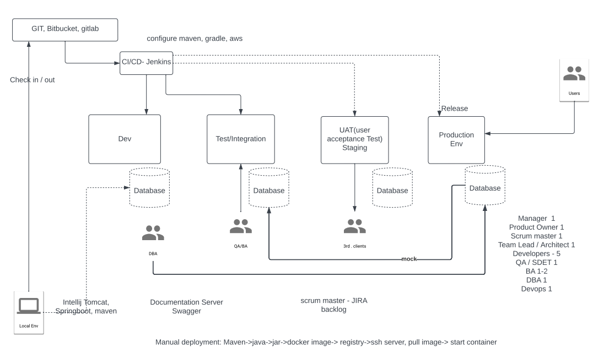

## Review
Monolithic
- advantages
    - simple to develop, debug and deploy
    - simple to scale horizontally by running multiple copies behid a load balancer
- disadvantages
    - lack of flexibility when it comes to update changes and redploy the application
    - continuous deployment is difficult
    - Monolithic applications can also be difficult to scale when different modules have conflicting resource requirements

microservices
- advantages
    - each module is responsible for a single responsibility (loose coupling), each service is developed by a single team
    - each service is deployed independently
    - each service is scaled independently
    - fault tolerance
- disadvantages
    - testing a microservices application is complex
    - deploying a microservices application is more complex than monolithic application
    - it is difficult to add changes that span multiple services

## New Things
Typical software dev production team

A small team is typically made of project manager/product owner/scrum master, 1 tech lead/architect, 5 or more devs, 1 QA, 1-2BA, 1DBA, 1 or more DevOps

## Plans for Tomorrow
1. Review client interview questions
2. Review spring boot microservices demo